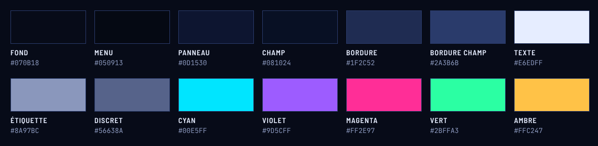

# RENTAL CAR : nouvelles interfaces « Néon sombre »

Maquettes à reproduire dans **Microsoft Access** (`Database20.accdb`).
Tout ce qui apparaît sur les maquettes peut se faire dans Access 2010 ou plus récent (Access 2016/2019/365) :
couleurs, bordures, boutons arrondis avec effet lumineux, images PNG. Les effets de « lueur » que
les rectangles d'Access ne savent pas faire (cartes indicateurs, logo, icônes) sont **déjà intégrés dans
les images PNG** du dossier `assets/`.

| Écran | Maquette | Formulaire Access |
|---|---|---|
| Connexion | [`maquettes/png/00-connexion.png`](maquettes/png/00-connexion.png) | `Login` |
| Tableau de bord | [`maquettes/png/01-tableau-de-bord.png`](maquettes/png/01-tableau-de-bord.png) | `Menu` + `Tableau Bord` |
| Réservations | [`maquettes/png/02-reservations.png`](maquettes/png/02-reservations.png) | `Réservation` |
| Clients | [`maquettes/png/03-clients.png`](maquettes/png/03-clients.png) | `Client` |
| Voitures | [`maquettes/png/04-voitures.png`](maquettes/png/04-voitures.png) | `Voiture` |
| Marques | [`maquettes/png/05-marques.png`](maquettes/png/05-marques.png) | `Marque` |
| Carburants | [`maquettes/png/06-carburants.png`](maquettes/png/06-carburants.png) | `Carburant` |
| Modèles | [`maquettes/png/07-modeles.png`](maquettes/png/07-modeles.png) | `Modèle` |

Contenu du dossier :

```
design/
├── README.md            ← ce guide
├── COTES.md             ← positions et tailles exactes (en cm) de chaque contrôle
├── maquettes/
│   ├── png/             ← les 8 maquettes en image (1568 × 784 px, votre taille d'écran)
│   └── *.html           ← mêmes maquettes, à ouvrir dans un navigateur
├── assets/              ← images à importer dans Access
│   ├── fonds/           fond-contenu.png (1344×716), fond-login.png (1568×784)
│   ├── cadres/          kpi-cyan / violet / magenta / vert.png (302×124)
│   ├── icones/          menu-*-off/on.png, action-*.png, nav-*.png, bouton-*.png, kpi-*.png…
│   ├── logo.png         188×52
│   ├── ligne-neon.png   ligne dégradée sous le bandeau
│   └── palette.png      aperçu des couleurs
└── outils/              ← générateur des maquettes (inutile pour Access)
```



---

## 1. Palette et polices

Dans la feuille de propriétés d'Access, vous pouvez **taper directement le code hexadécimal** (ex. `#0D1530`)
dans toutes les propriétés « Couleur … ».

| Rôle | Code | Où l'utiliser |
|---|---|---|
| Fond général | `#070B18` | Section Détail des sous-formulaires (derrière l'image de fond) |
| Fond menu | `#050913` | Barre latérale, fond des boutons de navigation |
| Fond bandeau | `#080D1C` | Bandeau du haut |
| Panneau | `#0D1530` | Rectangles « cartes » |
| Champ | `#081024` | Zones de texte, listes déroulantes, zones de liste |
| Bordure panneau | `#1F2C52` | Bordure des rectangles et des zones de liste |
| Bordure champ | `#2A3B6B` | Bordure des zones de texte, des boutons secondaires |
| Séparateur | `#18234A` | Traits horizontaux et verticaux |
| Texte | `#E6EDFF` | Valeurs, titres |
| Étiquette | `#8A97BC` | Étiquettes des champs |
| Discret | `#56638A` | Textes secondaires, compteurs |
| **Cyan** (accent principal) | `#00E5FF` | Bouton Enregistrer, élément actif, en-têtes de colonnes |
| **Violet** | `#9D5CFF` | Accent des panneaux « liste » |
| **Magenta** | `#FF2E97` | Supprimer, Quitter |
| **Vert** | `#2BFFA3` | Indicateurs positifs |
| **Ambre** | `#FFC247` | Indicateurs neutres |

| Usage | Police Windows | Taille Access |
|---|---|---|
| Titres, boutons, menu, en-têtes de colonnes | **Bahnschrift SemiBold** (installée avec Windows 10/11) | 11 à 12 pt (titre de page : 18 pt, chiffres des cartes : 28 pt) |
| Étiquettes et valeurs | **Segoe UI** | 11 pt (listes : 10 pt) |
| Date, codes, matricules | **Consolas** | 10 à 11 pt |

> Access n'a pas d'espacement entre les lettres : tapez simplement les titres **EN MAJUSCULES**.

---

## 2. Réglages à faire une seule fois

1. **Fichier › Options › Base de données active** :
   * *Options de la fenêtre document* : **Documents à onglets**, décochez *Afficher les onglets de document*.
   * Cochez **Utiliser les contrôles à thème Windows sur les formulaires** (indispensable pour les couleurs de survol,
     les formes arrondies et l'effet lumineux des boutons).
2. **Importer les images partagées** : ouvrez un formulaire en mode Création › onglet *Création* ›
   **Insérer une image › Parcourir…** et choisissez les PNG de `assets/`. Elles deviennent réutilisables dans tous les
   formulaires (propriété *Image* des boutons). Le PNG transparent est pris en charge.
3. Sur **chaque formulaire** (onglet *Format* de la feuille de propriétés) :
   `Sélecteur d'enregistrement` = Non · `Boutons de déplacement` = Non · `Diviseurs d'enregistrements` = Non ·
   `Barre de défilement` = Aucune · `Style de bordure` = Aucun (pour les sous-formulaires).
4. Pour chaque **sous-formulaire** (Tableau Bord, Réservation, Client…) :
   * `Image` = `fond-contenu.png` · `Mode d'affichage de l'image` = **Découpage** · `Alignement de l'image` = **Haut gauche**
   * Section *Détail* : `Couleur fond` = `#070B18`
   * Taille conseillée : **35,56 × 18,94 cm** (1344 × 716 px).

---

## 3. Recettes par type de contrôle

### Panneau (carte)
Un **Rectangle** + une **Étiquette** titre + un petit **Rectangle** d'accent + un **Trait** séparateur.

| Élément | Propriétés |
|---|---|
| Rectangle | `Style fond` Normal · `Couleur fond` `#0D1530` · `Style bordure` Continu · `Couleur bordure` `#1F2C52` · `Épaisseur bordure` Filet · `Effet spécial` Plat |
| Accent (0,08 × 0,48 cm, à 0,48 cm du bord) | `Couleur fond` `#00E5FF` (violet `#9D5CFF` pour les listes, magenta `#FF2E97` pour les réservations) · `Style bordure` Transparent |
| Titre | Bahnschrift SemiBold 12 pt · `Couleur texte` `#E6EDFF` · `Style fond` Transparent |
| Sous-titre (ex. « 200 CLIENTS ») | Consolas 8 pt · `#56638A` |
| Trait sous le titre (à 1,38 cm du haut) | `Couleur bordure` `#18234A` |

> Placez le rectangle **en premier** puis *Organiser › Mettre en arrière-plan*, sinon il cache les champs.

### Étiquettes et zones de texte
| Élément | Propriétés |
|---|---|
| Étiquette | Segoe UI 11 pt · `#8A97BC` · `Aligner le texte` Droite · `Style fond` Transparent |
| Zone de texte / liste déroulante | `Couleur fond` `#081024` · `Style bordure` Continu · `Couleur bordure` `#2A3B6B` · `Couleur texte` `#E6EDFF` · Segoe UI 11 pt · `Effet spécial` Plat · `Marge gauche` 0,25 cm · `Marge supérieure` 0,12 cm · hauteur **0,9 cm** |
| Champ en lecture seule (Téléphone, Email, Modèle, Marque, Durée) | pareil, mais `Style bordure` **Tirets** · `Couleur fond` `#0A1330` · `Couleur texte` `#A9B8E0` · `Verrouillé` Oui |
| Champ « Montant » | `Couleur fond` `#061A26` · `Couleur bordure` `#0E5566` · `Couleur texte` `#00E5FF` · Bahnschrift SemiBold 15 pt · Droite · hauteur 1,11 cm |

> La petite flèche des listes déroulantes suit le thème de Windows : sa couleur ne se règle pas.

### Boutons
Sélectionnez le bouton, `Utiliser le thème` = **Oui**, puis onglet **Format › Modifier la forme › Rectangle à coins arrondis**.

| Bouton | Fond | Survol (`Couleur de pointage`) | Appuyé | Bordure | Texte | Effet de forme › Lumière |
|---|---|---|---|---|---|---|
| **Enregistrer** | `#00E5FF` | `#5CF0FF` | `#00B8D4` | `#00E5FF` | `#03121F` Bahnschrift Bold 11 | cyan 5 pt (`#00E5FF`) |
| **Supprimer** | `#1A0B1E` | `#2A0F2C` | `#3A1238` | `#FF2E97` | `#FF2E97` Bahnschrift Bold 11 | magenta 3 pt |
| **OK** / secondaire | `#0A1226` | `#0F1E38` | `#0C1C30` | `#0E5566` | `#00E5FF` | aucun |
| Navigation ⏮ ◀ ▶ ⏭ | `#0A1226` | `#13213F` | `#0C1C30` | `#2A3B6B` | – | aucun |
| Icônes rondes ＋ ⟳ 🔍 🖨 | `#0A1226` | `#13213F` | `#0C1C30` | `#2A3B6B` | – | aucun · forme **Ellipse** |
| Quitter (bandeau) | `#1A0B1E` | `#2A0F2C` | `#3A1238` | `#FF2E97` | – | magenta 3 pt · forme **Ellipse** |

Images des boutons (propriété `Image`, `Disposition image légende` = **Gauche**) :
`bouton-enregistrer.png`, `bouton-supprimer.png`, `bouton-ok.png`, `nav-chevron-first/left/right/last.png`,
`action-plus.png`, `action-refresh-cw.png`, `action-search.png`, `action-printer.png`, `quitter.png`.

> Pour la lumière : *Format › Effets de forme › Lumière › Variantes de lumière* puis
> *Autres couleurs de lumière* pour saisir le code exact.

### Zones de liste (listes de droite)
Dans Access, la ligne d'en-tête d'une zone de liste prend **la même couleur que les lignes**. Pour obtenir
les en-têtes cyan de la maquette :

1. Zone de liste : `En-têtes colonnes` = **Non** · `Couleur fond` `#081024` · `Couleur bordure` `#1F2C52` ·
   `Couleur texte` `#D6E2FF` · Segoe UI 10 pt · `Largeurs colonnes` = celles de la maquette (voir `COTES.md`).
2. Au-dessus de la liste, une **étiquette par colonne** : Bahnschrift SemiBold 9 pt, `#00E5FF`, en majuscules,
   alignée sur les colonnes, puis un **Trait** `#1B3A55` en dessous.
3. Pour aligner les montants à droite ou formater les dates, faites-le dans la requête :
   `Format([CA];"# ##0")`, `Format([DateDebut];"jj/mm/aaaa")`.

> La barre de défilement et la ligne sélectionnée gardent les couleurs de Windows : ça ne se règle pas.

### Cartes indicateurs (Tableau de bord)
1. **Image** avec `kpi-cyan.png` (ou violet / magenta / vert), 7,99 × 3,28 cm, `Style fond` Transparent,
   puis *Mettre en arrière-plan*.
2. Par-dessus : étiquette titre (Bahnschrift SemiBold 10 pt, couleur de la carte), zone de texte valeur
   (Bahnschrift SemiBold **28 pt**, `#FFFFFF`, fond et bordure transparents), sous-texte (Segoe UI 9 pt, `#8A97BC`)
   et l'icône `kpi-wallet-cyan.png`, `kpi-car-front-violet.png`, `kpi-users-magenta.png` ou
   `kpi-calendar-check-vert.png`.

### Formulaire « Menu » (barre latérale + bandeau)
Votre formulaire `Menu` est un **formulaire de navigation** (boutons `BoutonNavigation…`) : c'est parfait.

| Élément | Propriétés |
|---|---|
| Section Détail / en-tête | `Couleur fond` `#050913` |
| Rectangle bandeau (5,93 → 41,49 cm × 1,80 cm) | `#080D1C`, sans bordure, puis image `ligne-neon.png` juste en dessous |
| Logo | Image `logo.png` en haut à gauche |
| **Boutons de navigation** | `Couleur fond` `#050913` · `Couleur de pointage` `#0A1628` · `Couleur si appuyé` **`#0C1C30`** · `Couleur texte` `#7F8BB0` · `Couleur texte de pointage` `#E6EDFF` · `Couleur texte si appuyé` **`#00E5FF`** · `Couleur bordure` `#050913` · Bahnschrift SemiBold 11 pt · forme Rectangle à coins arrondis · `Image` = `menu-…-off.png` · `Disposition image légende` Gauche · hauteur 1,16 cm |
| Titre de page | Étiquette Bahnschrift SemiBold 18 pt `#E6EDFF` |
| Date / heure | Zone de texte `=Maintenant()` · `Format` `jj/mm/aaaa hh:nn` · Consolas 11 pt `#00E5FF` · fond `#0A1426` · bordure `#1E3A5A` |
| Bloc « Système en ligne » | Rectangle `#070D1C` bordure `#16213F` + étiquettes (vert `#2BFFA3`, Consolas 8 pt `#56638A`) |

Code facultatif (module du formulaire `Menu`) pour faire avancer l'horloge et allumer l'icône de l'onglet actif :

```vba
Private Sub Form_Load()
    Me.TimerInterval = 30000          ' rafraîchit l'heure toutes les 30 s
End Sub

Private Sub Form_Timer()
    Me.Date_Heure.Requery
End Sub

' À appeler dans l'événement « Sur clic » de chaque bouton de navigation,
' ex. : AllumerOnglet Me.BoutonNavigation_clients, "users"
Public Sub AllumerOnglet(btn As Control, icone As String)
    Dim c As Control
    For Each c In Me.Controls
        If c.ControlType = acNavigationButton Then
            c.Picture = Replace(c.Picture, "-on", "-off")
        End If
    Next
    btn.Picture = "menu-" & icone & "-on"
End Sub
```
*(les noms `menu-users-on`, `menu-users-off`… sont ceux des images partagées importées à l'étape 2.2)*

### Formulaire « Login »
* `Image` du formulaire = `fond-login.png` · `Mode d'affichage de l'image` = **Étirer** (ou Zoom) · `Fenêtre indépendante` Oui · `Fenêtre modale` Oui.
* Rectangle carte `#0B1229`, bordure `#23336A`, 11,11 × 14,39 cm, centré.
* Icône `login-cadenas.png`, icônes de champ `champ-user.png` et `champ-lock.png` placées **dans** les zones de texte
  (zones de texte avec `Marge gauche` = 1,15 cm).
* Mot de passe : `Masque de saisie` = **Mot de passe**.
* Bouton « SE CONNECTER » : même style qu'Enregistrer, 9 × 1,22 cm, image `bouton-connexion.png`.

---

## 4. Nouveaux éléments du tableau de bord : formules

| Élément | Source contrôle (Access en français) |
|---|---|
| Carte « Réservations » | `=CpteDom("*";"Reservation")` |
| « 8 en cours aujourd'hui » | `=CpteDom("*";"Reservation";"DateDebut<=Date() And DateFin>=Date()") & " en cours aujourd'hui"` |
| Durée moyenne | `=Round(MoyDom("[DateFin]-[DateDebut]";"Reservation");0)` (Round garde son nom anglais ; « Arrond » est une autre fonction) |
| Taux d'occupation | `=CpteDom("*";"Reservation";"DateDebut<=Date() And DateFin>=Date()")/CpteDom("*";"Voiture")` avec `Format` = Pourcentage, `Décimales` = 1 |
| Colonne « Restant » (dans la requête) | `Restant: [DateFin]-Date() & " j"` |
| Montants avec espaces | propriété `Format` : `# ##0" FCFA"` |
| « Flotte par marque » | `=CpteDom("*";"Modele";"Marque=1")` (1 = Audi, 2 = BMW…) |

---

## 5. Problèmes repérés dans la base en préparant les maquettes

1. **Réservation n° 11** : la date de fin (06/12/2026) est **avant** la date de début (13/02/2027). La durée est donc
   négative et **fausse le chiffre d'affaires**. Corrigez la ligne, puis ajoutez dans les propriétés de la table
   `Reservation` : `Valide si` = `[DateFin]>=[DateDebut]`, `Message si erreur` = « La date de fin doit suivre la date de début ».
2. **Requête « Voitures réservées »** : le seul critère est `DateFin >= Date()`, donc elle affiche aussi les réservations
   **futures** (ex. n° 6, qui commence le 04/12/2026). Pour les voitures *actuellement* réservées, ajoutez
   `DateDebut <= Date()` (au 28/09/2026 : **8** réservations en cours, pas 25).
3. La même liste affiche le **numéro** du modèle (2, 5, 9…) : ajoutez la table `Modele` à la requête et affichez `Modele.Modele`.
4. La requête « Liste des réservations » contient **deux fois** la jointure Marque ↔ Modèle : supprimez le doublon.
5. La table `Users` stocke les mots de passe **en clair**.

---

## 6. Régénérer les maquettes (facultatif)

```bash
cd design/outils
npm install                      # puppeteer-core + chromium sans interface
python3 generer.py               # recrée maquettes/png, assets/ et COTES.md
```
Les couleurs, textes et dispositions se modifient dans `outils/generer.py` et `maquettes/style.css`.
Icônes : [Lucide](https://lucide.dev) (licence ISC).
